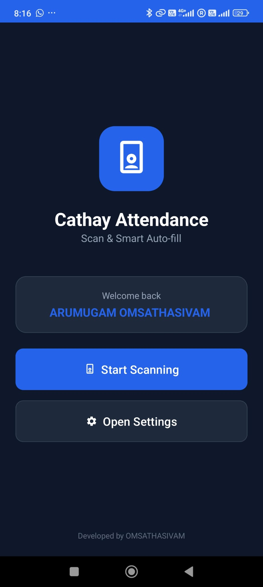
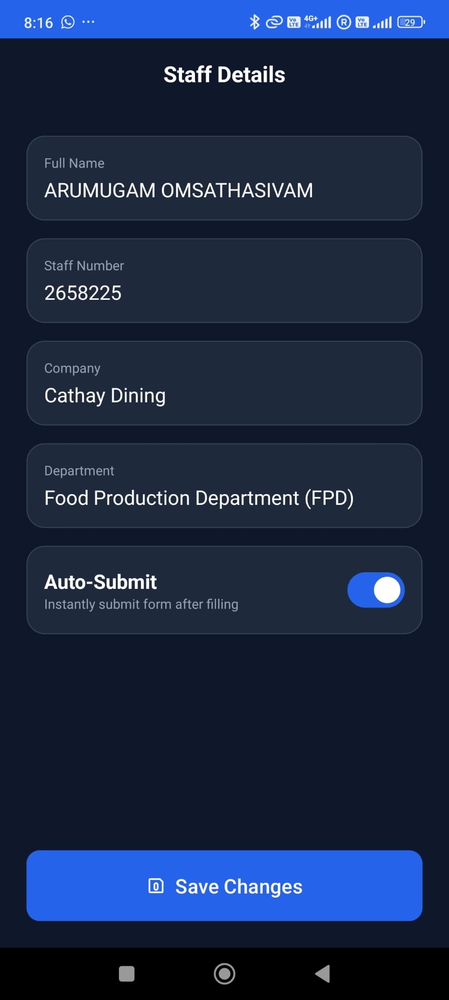
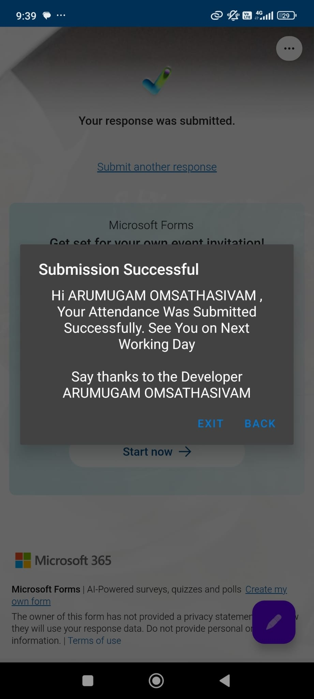

# Cathay Attendance

A Safety Dialogue Attendance Record Filler for Cathay Dining

## Features

- 📱 Barcode/QR code scanning with CameraX and ML Kit
- ⚙️ Staff profile management (Name, Staff Number, Company, Department)
- 🌐 Auto-submit attendance
- 🎨 Beautiful, modern UI

## Screenshots

## Permissions

- Camera - for barcode scanning
- Internet - for form submission

## Developed by

ARUMUGAM OMSATHASIVAM

## How to Use

1. Open Settings to enter your staff profile
2. Tap "Start Scanning" to scan a barcode/QR code
3. The app will auto-fill and submit your attendance!
